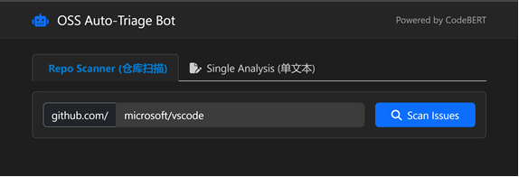
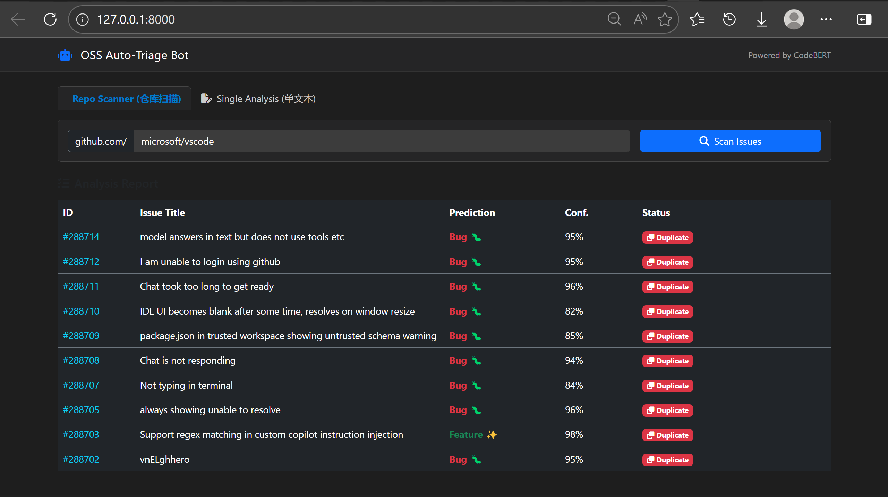

# OSS Issue Classifier (开源软件维护智能辅助系统)


> **基于 CodeBERT 的 Issue 自动化分类与语义查重系统** > _A Smart Triage Bot for Open Source Maintenance based on CodeBERT and Semantic Search._

##  项目简介 (Introduction)

随着开源项目的快速发展，海量的 Issue 提交给维护者带来了巨大的工作负担。本项目旨在利用深度学习技术，辅助开源社区进行高效的 Issue 管理。

本系统基于微软 **CodeBERT** 预训练模型进行微调，能够理解包含代码片段的文本语义，实现：
1. **智能分类**：自动区分 Issue 为 `Bug` 或 `Feature`。
2. **仓库扫描**：一键对 GitHub 仓库进行健康度体检，自动过滤 PR，专注于 Issue 分析。
3. **语义查重**：基于高维向量检索（Vector Search），实时发现潜在的重复问题（Duplicate）。

本项目为《开源软件基础》课程大作业，由个人独立全栈开发。

##  核心功能 (Features)

- **AI 智能分拣**：利用微调后的 CodeBERT 模型，准确率达 82.6%。
- ** 仓库一键扫描 (Repo Scanner)**：
  - 支持输入 GitHub 仓库地址（如 `microsoft/vscode`）。
  - 智能分页与流式过滤，自动剔除 Pull Request。
  - 实时生成分类报表与置信度分析。
- **单文本深度分析**：支持手动输入标题与正文，进行详细诊断。
- **毫秒级语义查重**：利用 PyTorch 矩阵运算加速，实时推荐 Top-3 相似的历史 Issue。
- **UI 现代化界面**：基于 Bootstrap 5 的响应式设计，支持深色模式 (Dark Mode)。

## 技术栈 (Tech Stack)

* **开发语言**: Python 3.9
* **深度学习**: PyTorch, Hugging Face Transformers (CodeBERT)
* **后端框架**: Django 4.2
* **数据处理**: Pandas, Scikit-learn, Numpy
* **前端框架**: HTML5, Bootstrap 5, JavaScript (AJAX)
* **开发工具**: VSCode, Git

## 🚀 快速开始 (Quick Start)

### 1. 克隆项目
```bash
git clone [https://github.com/KongFFF/OSS-Issue-Classifier.git]
cd OSS-Issue-Classifier
```
### 2. 环境配置
建议使用 Conda 创建虚拟环境：

```Bash
conda create -n oss_project python=3.9
conda activate oss_project
pip install -r requirements.txt
```
### 3. 配置 GitHub Token (重要)
为了防止 GitHub API 速率限制（Rate Limit），请设置环境变量。

Windows (PowerShell):

```PowerShell
$env:GITHUB_TOKEN="你的GitHub_Token"
```
Linux/Mac:

```Bash
export GITHUB_TOKEN="你的GitHub_Token"
```
### 4. 运行系统
进入后端目录并启动 Django 服务器：

```Bash
cd oss_backend
python manage.py runserver
```
### 5. 访问
打开浏览器访问：http://127.0.0.1:8000/

### 项目结构 (Structure)
```Plaintext
OSS-Issue-Classifier/
├── data_collector.py          # GitHub 数据采集爬虫
├── train.py                   # CodeBERT 模型微调训练脚本
├── vscode_dataset_clean.csv   # 清洗后的训练数据集
├── requirements.txt           # 项目依赖库
├── oss_backend/               # Django 后端工程
│   ├── manage.py
│   ├── oss_backend/           # 核心配置
│   └── classifier/            # 核心 App
│       ├── views.py           # 业务逻辑 (推理、扫描、查重)
│       ├── build_index.py     # 向量索引构建脚本
│       ├── issue_index.pt     # 预计算的向量索引文件
│       ├── saved_model/       # 微调后的模型权重
│       └── templates/         # 前端 HTML 页面
└── README.md                  # 项目说明文档
```
### 效果展示 (Screenshots)
1. 首页与仓库扫描


2. 扫描结果与查重警告


### 作者 
Developer: [房文博]

Email: [3192972081@qq.com]

Date: 2026-01

### 许可证 
本项目采用 MIT License 开源许可证。


